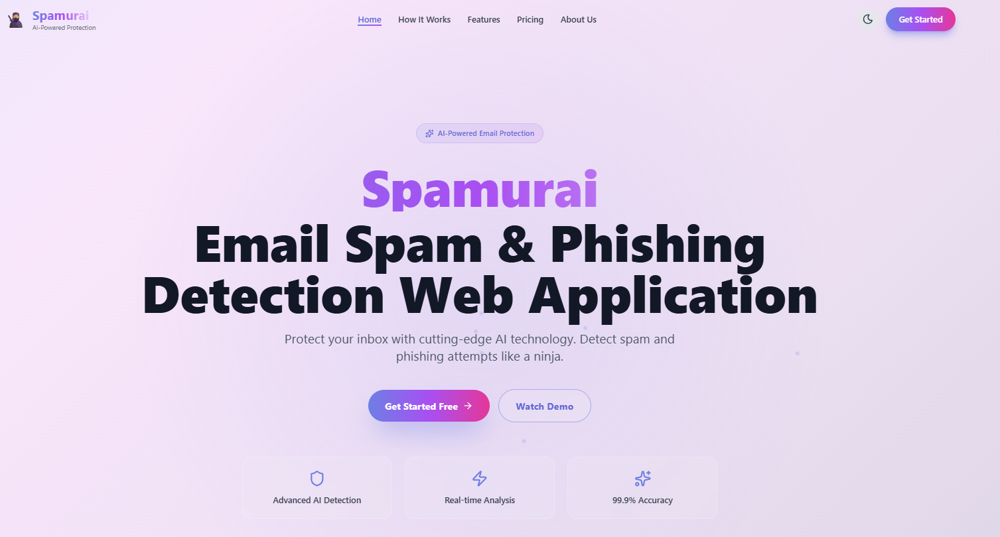
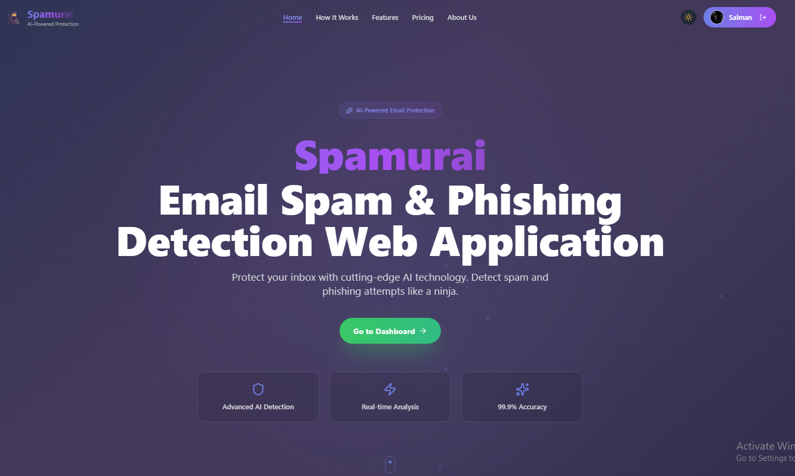
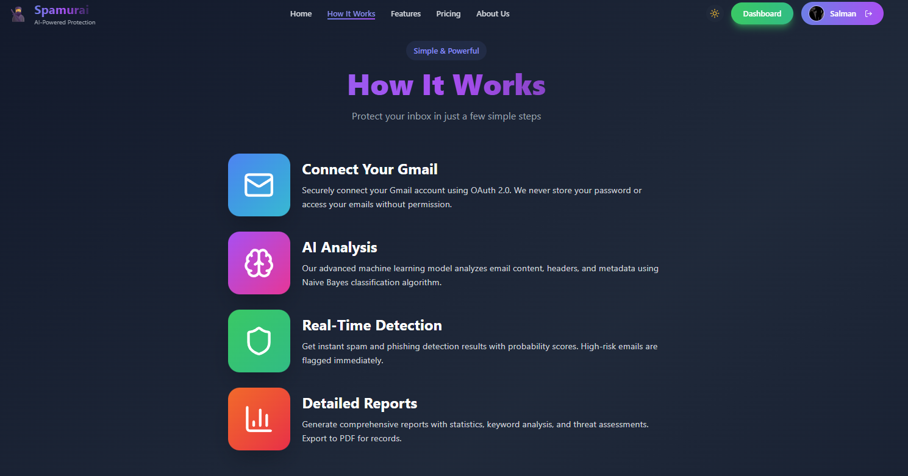
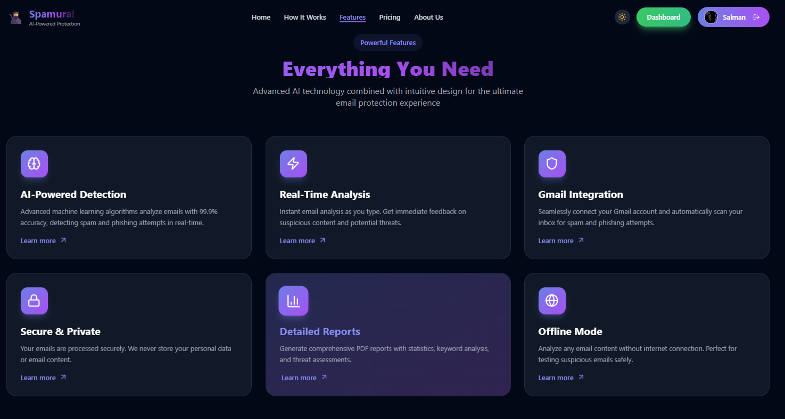
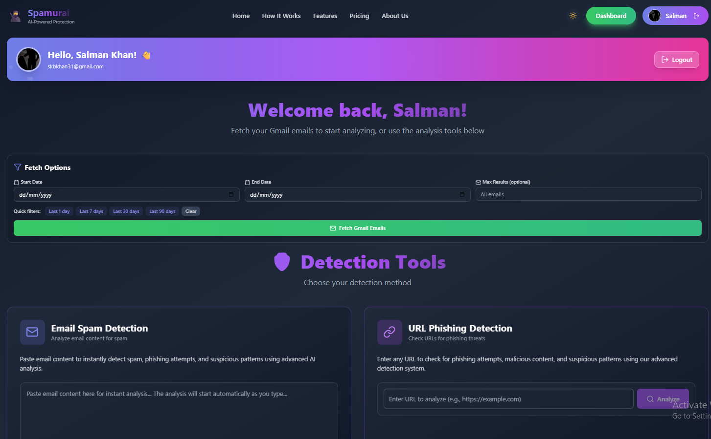
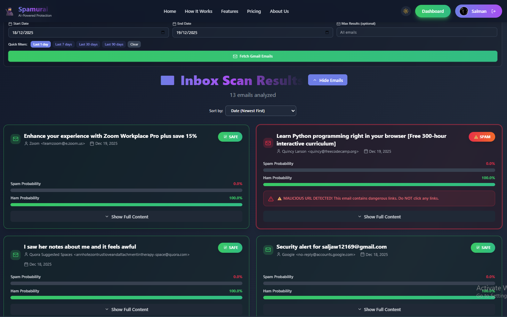
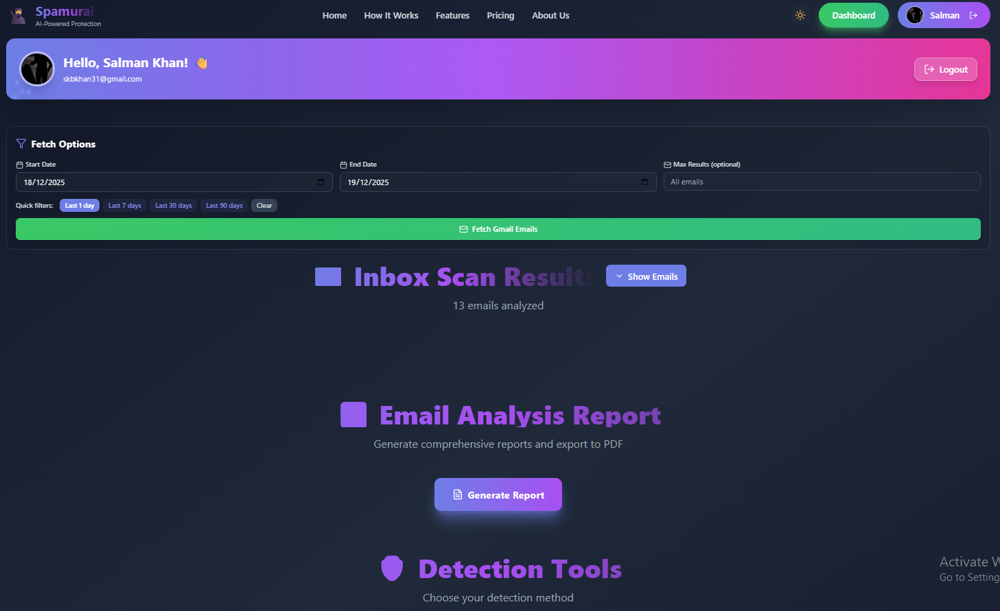
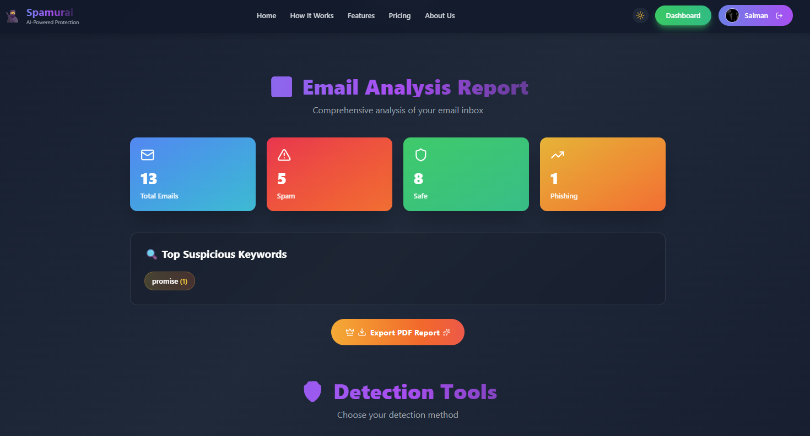
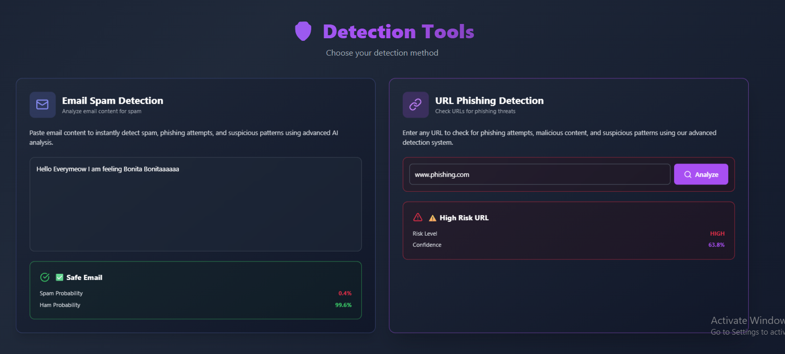
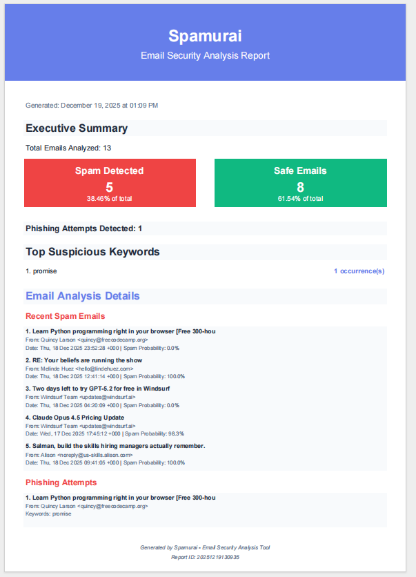

# 🥷 Spamurai ( AI-Powered Spam & Phishing Detector) 

*Detect spam and phishing like a ninja!*

**Spamurai** is a full-stack machine learning app that classifies emails as **Spam**, **Ham**, or **Phishing**.  
Built with **Scikit-learn**, **React**, and **Flask**, it can run **offline** or connect securely to your Gmail inbox.

---

## 🚀 Key Features

### 🔐 Gmail Integration
- Secure **Google OAuth 2.0 login**
- Fetch the **Any Number of Gmail emails you desired with help of Counter**
- Automatic **spam email and URL prediction** with probability scores

### 🤖 AI-Powered Classification
- **Scikit-learn ML Pipeline:** `CountVectorizer → MultinomialNaiveBayes`
- **Outputs:**
  - Spam & Ham probability
  - Phishing keyword indicators
  - Extracted and highlighted URLs
  - URL auto-checking with URLGuard

### 🧪 Offline Mode
- Paste any email or text to get:
  - Spam & Ham scores
  - URL risk analysis
  - Keyword risk detection
  
### 🛡️ URLGuard ( Malicious URL Detector )
- Standalone ML pipeline trained on **malicious_phish.csv**
- **Pipeline:** `URLFeatureExtractor → ColumnTransformer → RandomForestClassifier`
- Detects:
  - Malware URLs  
  - Phishing URLs  
  - Defacement URLs  
  - Benign URLs
- Extracts numeric + domain-based features:
  - URL length  
  - Digit and letter counts  
  - Special character count  
  - Dot and slash frequency  
  - Shannon entropy  
  - Domain bag-of-words  
- Outputs threat labels using `url_guard_pipeline.joblib`

### 📦 PDF Report Export
- Generates a professional PDF with:
  - Classification results
  - Risk analysis
  - Keyword summary
  - Suspicious URLs
  - Email statistics

### 🧰 Full-Stack Power
- **React frontend**
- **Flask backend**
- Centralized ML models:
  - `spam_model.joblib`
  - `url_guard_pipeline.joblib`
- Clean, well-documented **API endpoints**

## 📸 Application Interfaces

*Visual walkthrough of Spamurai’s main interfaces and workflow*

---

### 🏠 Home Page (Before Login)

---

### 🏠 Home Page (After Login)

---

### ⚙️ How the Application Works

---

### ✨ Core Features Overview

---

### 📊 Dashboard (Before Fetching Emails)

---

### 📊 Dashboard (After Fetching Emails)

---

### 🧾 Classification Summary Report

---

### 📧 Email Analysis Report

---

### 🧪 Offline Mode (Without Login: Email & URL Detection)

---

### 📥 Downloaded PDF Analysis Report

